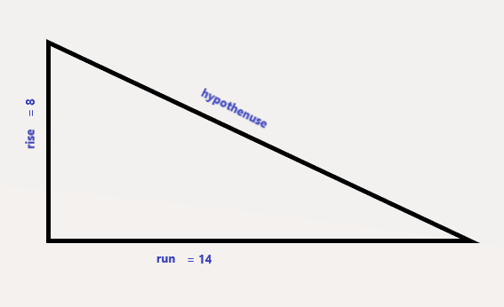
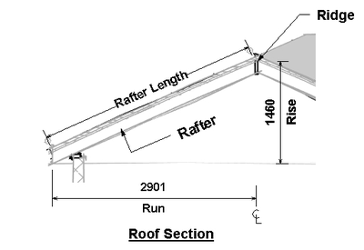
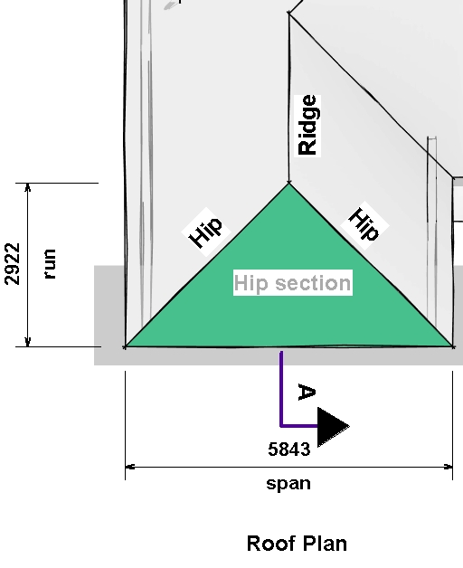
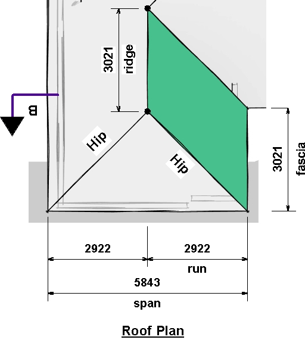

# b-cal: Easy Estimating
A Construction Estimator and Building Parts calculator

## Introduction

B-cal provides a suite of geometric and trigonomic functions essential to estimating construction and industry related jobs.

## Installation
    $ pip install b_cal

## Usage
    [1] from b_cal.calculator import Calculator
    [2] cal = Calculator()

Find the hypothenuse of A triangle given its 
rise and base length.
 

    [3] cal.hypothenuse(rise=8, run=14)

## Construction Estimating
 
Calculate the length of a rafter given 
its rise and run  

    [4] cal.rafter(rise=1460, run=2901)

Calculate the area and hip length of a Roof Hip Section

 

    In  [5]: cal.hip(rise=1469, run=2922, span=5843)
    Out [6]: 
    {'area':9554709.81,
     'fascia': 5843,
     'hip': 4385.34,
     'pitch': 0.50273785,
     'rise': 1469,
     'run': 2922,
     'slope': 28.8,
     'span': 5843 }

b-cal returns a JSON object with key mapping to computed values of the roof segment,
area in square units, fascia, hip, rise, run and span in run length units,
pitch in radians and slope in degrees.

Calculate Area of Roof segment given the length of ridge, the length of the fascia, the run and rise 
distances.

    In [7]: cal.roof_segment(ridge=3021, fascia=3021, rise=1469, run=2922,)
    Out [8]: 
    {'area':9554709.81,
    'fascia': 3021,
    'pitch': 0.50273785,
    'rafter': 3270.48,
    'ridge': 3021,
    'rise': 1469,
    'run': 2922,
    'slope': 28.8}

### Dependency
python 3.6 ++

       

    

