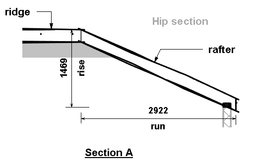

# b-cal: Easy Estimating
A Construction Estimator and Building Parts calculator

## Introduction

B-cal provides a suite of geometric and trigonomic functions essential to estimating construction and industry related jobs.

## Installation

```
$ pip install b_cal
```

## Usage

```
In  [1]: from b_cal.calculator import Calculator
Out [2]: cal = Calculator()
```

## Geometry 

Find the hypothenuse of A triangle given its 
rise and base length.
 

    [3] cal.hypothenuse(rise=8, run=14)


## Construction Estimating
 
=======
## Estimate Building Components 

B-cal's Building Parts calculator currently estimates building foundations, walls,
beams, columns, floors and roofs. B-cal returns its results in JSON format but can reproduce 
complete job estimate reports in various other file formats.

### Estimating Concrete Block Walls 

Estimate a concrete block wall given its length its height and thickness.


### Estimating Roof Segments


Calculate the length of a rafter given 
its rise and run <br>


    [4] cal.rafter(rise=1460, run=2901)


Calculate the area and hip length of a Roof Hip Section




``` 
In  [5]: cal.hip(rise=1469, run=2922, span=5843)
```
```json 
    {"area":9554709.81,
     "fascia": 5843,
     "hip": 4385.34,
     "pitch": 0.50273785,
     "rise": 1469,
     "run": 2922,
     "slope": 28.8,
     "span": 5843 }
```


b-cal returns a JSON object with key mapping to computed values of the roof segment,
area in square units, fascia, hip, rise, run and span in run length units,
pitch in radians and slope in degrees.


Calculate Area of Roof segment given the length of ridge, the length of the fascia, the run and rise 
distances.


    In [7]: cal.roof_segment(ridge=3021, fascia=3021, rise=1469, run=2922,)
    Out [8]: 
    {'area':9554709.81,
    'fascia': 3021,
    'pitch': 0.50273785,
    'rafter': 3270.48,
    'ridge': 3021,
    'rise': 1469,
    'run': 2922,
    'slope': 28.8}

### System of Measurements 

B-cal defaults to the standard metric system of measurements but will accept imperial
units if declared as a parameter argument eg: nuits='inch', units='sqrinch', units='inch2', units='ft', units='sqrft', units='f2'.<br>
Note: If a units parameter is present b-cal ressets its measurement units for all calculations for 
the entire usage session.

### Output File Formats

B-cal can reproduce reports, in various file formats. A JSON file is produced with the save.to_json() Api
save.to_pdf() produces a .pdf file save.to_xls() produces a .xls file save.to_txt() produces a .txt file
and save.to_csv() produces a .csv file.
 
### Dependency
python 3.6 ++


       


    


